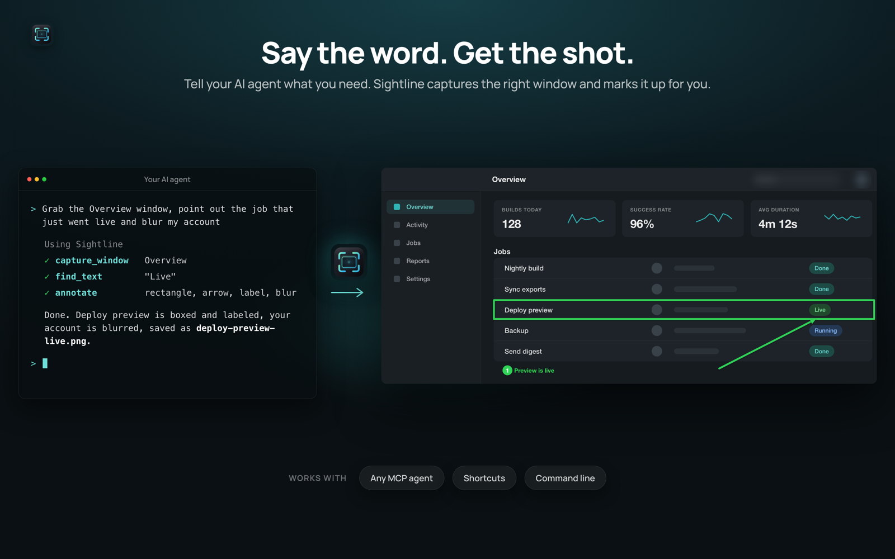
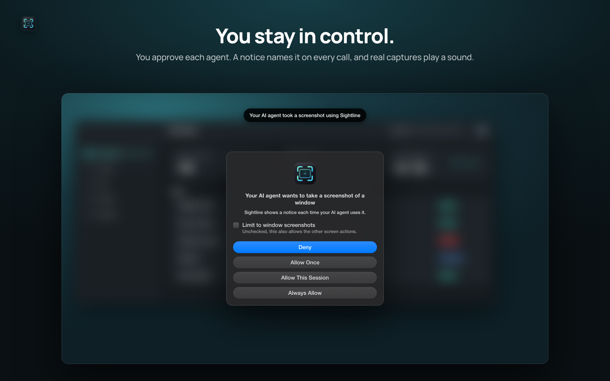

# Sightline MCP server

Screenshots, OCR, scrolling capture, annotations and screen recording on macOS for AI agents like Claude Code, Claude Desktop and Codex CLI.

The server is part of [Sightline](https://apps.apple.com/app/id6812521593), a menu bar screenshot and recording app for the Mac ([website](https://philjay.github.io/sightline-site/)). It runs locally over stdio and nothing leaves your Mac.



## You stay in control



- Agent access is off until you turn it on in Settings > AI Agents.
- A new agent has to ask for permission first. Allowed agents are listed in Settings and can be removed at any time.
- Every agent capture plays the capture sound and names the agent.
- Agents can't change settings and only read and write inside your screenshot folder.

## Setup

1. Install [Sightline](https://apps.apple.com/app/id6812521593) from the Mac App Store (macOS 14 or later) and give it Screen Recording permission.
2. Open Settings > AI Agents, turn agent access on and click Connect for Claude Code, Claude Desktop or Codex CLI.

Or add it by hand. Claude Code:

```
claude mcp add --scope user sightline -- "/Applications/Sightline.app/Contents/MacOS/sightline-cli" mcp
```

Codex CLI, in `~/.codex/config.toml`:

```toml
[mcp_servers.sightline]
command = "/Applications/Sightline.app/Contents/MacOS/sightline-cli"
args = ["mcp"]
```

Any other client: run `/Applications/Sightline.app/Contents/MacOS/sightline-cli mcp` as a stdio server.

## Tools

- `capture_screen`, `capture_area`, `capture_window` capture a display, an area or a window, optionally with annotations.
- `list_windows` lists the on-screen windows with app name, title and window id.
- `list_displays` lists the connected displays, so a capture, recording or text read can pick one.
- `capture_text` reads text with on-device OCR and decodes QR codes and barcodes.
- `find_text` returns pixel boxes for text in a window, area or display.
- `capture_scrolling` stitches a scrolling area or window into one tall image.
- `annotate` draws arrows, shapes, text, spotlights and blurs onto an image or a video, crops images and trims videos.
- `record_screen` records a window, area or display for up to a minute to MP4.
- `inspect_recording` reports when a recording is still or moving and reads text in chosen frames.
- `last_screenshot`, `last_recording` return the newest capture.
- `copy_to_clipboard` copies an image to the clipboard.
- `open_in_editor` opens an image or recording in the Sightline editor with editable annotations.
- `save_replay` saves the last seconds of the screen when Replay is on (macOS 27).
